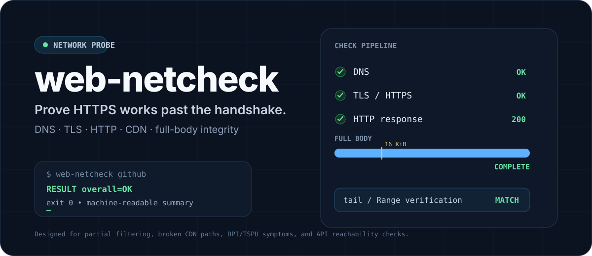
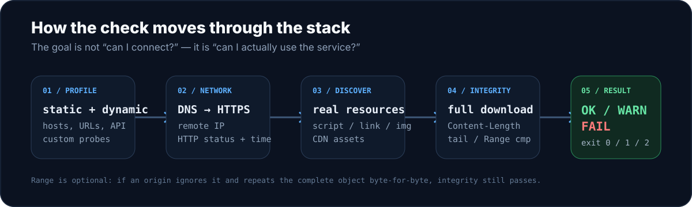
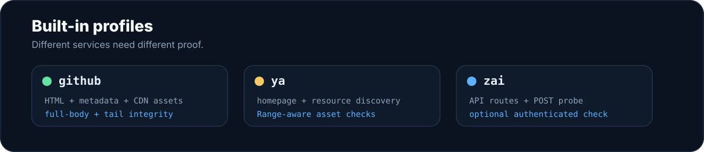

<p align="center">
  
</p>

<p align="center">
  
  
  
  
</p>

<p align="center">
  <strong>End-to-end HTTPS reachability and payload-integrity checks from a Linux host.</strong><br>
  Detect the cases where DNS, TCP and TLS look healthy, but the real service, CDN or API path is not.
</p>

---

## Quick start

On Ubuntu 24.04:

```bash
sudo apt update
sudo apt install -y curl dnsutils coreutils jq

git clone https://github.com/nimbo78/web-netcheck.git
cd web-netcheck

bash bin/web-netcheck github
```

A healthy run ends with a machine-readable summary:

```text
RESULT base_latency=OK
RESULT endpoint_reachability=OK
RESULT metadata_discovery=OK
RESULT asset_integrity=OK
RESULT overall=OK
```

Install system-wide when you are ready:

```bash
sudo install -m 0755 bin/web-netcheck /usr/local/bin/web-netcheck
sudo mkdir -p /etc/web-netcheck
sudo install -m 0644 profiles/*.conf /etc/web-netcheck/
```

> `jq` is only required by profiles that use JSON metadata discovery, such as GitHub.

## Base URL latency

By default, `web-netcheck` requests the profile's `BASE_URL` **10 times with a 1 second pause** between attempts. Each request uses a fresh `curl` process and reports cumulative timing checkpoints:

```text
TRY  HTTP  REMOTE_IP       DNS       CONNECT   TLS_READY TTFB      TOTAL
1    200   77.88.44.242    0.004s    0.011s    0.034s    1.521s    1.585s
2    200   77.88.44.242    0.003s    0.010s    0.032s    1.691s    1.750s
...
```

The timing columns map to curl's `time_namelookup`, `time_connect`, `time_appconnect`, `time_starttransfer` and `time_total`. They are cumulative timestamps from the start of each request, not independent phase durations.

At the end the tool summarizes total request time:

```text
Base URL attempts: success=10 failure=0 delay=1s
Total time: min=1.421s avg=1.603s p50=1.585s p95=1.750s max=1.750s
```

Override the defaults when needed:

```bash
web-netcheck ya --base-attempts 20 --base-delay 0.5

# Disable repeated base probes
web-netcheck ya --base-attempts 0
```

Any transport-level failure during the repeated base probe sets `RESULT base_latency=FAIL` and contributes to the overall failure.

## What this catches

A service can resolve in DNS, complete a TLS handshake and still be unusable.

`web-netcheck` is designed to expose failures such as:

- the main page works while a secondary CDN hostname times out;
- a transfer starts but is truncated after the first few KiB;
- the announced `Content-Length` does not match the received object;
- the full object downloads but an independent tail check does not match;
- a required API route answers with `5xx` even though port 443 is reachable;
- a service dependency disappears while the front page still looks healthy.

A representative asset check looks like this:

```text
Asset #1
Expected: 193446 bytes (188.91 KiB)

FULL GET: HTTP=200 curl_size=193446 actual=193446
FULL GET: OK

TAIL GET: HTTP=206 bytes=4096
TAIL CMP: OK final 4096 bytes match independent Range response

RESULT asset_integrity=OK
```

The default minimum asset size is **32 KiB**: large enough to cross a suspected 16 KiB truncation boundary without requiring unusually large page resources.

<p align="center">
  
</p>

## How it works

For web-oriented profiles, the checker combines three kinds of evidence:

1. **Static critical endpoints** defined by the profile.
2. **Dynamic dependencies** discovered from resource-bearing HTML tags such as `script`, `link`, `img`, `source` and `iframe`.
3. **Vendor metadata or custom probes** when the service exposes useful machine-readable endpoint data or requires an API-specific request.

Ordinary navigation links such as social/footer `<a href="...">` URLs are intentionally ignored: they are not dependencies of the page.

For each relevant hostname the tool checks DNS and HTTPS reachability. For selected assets it then:

1. obtains the expected object size;
2. downloads the complete object;
3. verifies the received byte count;
4. calculates SHA-256;
5. requests the final bytes independently with HTTP Range;
6. compares that tail byte-for-byte with the original download.

HTTP Range support is **optional**. If an origin ignores `Range`, returns `200 OK` and sends the complete object again, `web-netcheck` compares the repeated object with the first download. An exact match passes instead of producing a false failure.

<p align="center">
  
</p>

## Built-in profiles

| Profile | What it proves | Run |
| --- | --- | --- |
| **`github`** | GitHub web/API/CDN/download/registry reachability, current page resources, `api.github.com/meta`, large asset integrity | `web-netcheck github` |
| **`ya`** | Yandex homepage dependencies and real CSS/JS asset delivery | `web-netcheck ya` |
| **`zai`** | Z.AI API reachability plus an Anthropic-compatible POST probe | `web-netcheck zai` |

### GitHub

```bash
web-netcheck github
```

Useful variants:

```bash
web-netcheck github --assets 5
web-netcheck github --min-size 131072
web-netcheck github -6
web-netcheck github --verbose

# Repeat the main URL 10 times with a 1s pause (default)
web-netcheck github --base-attempts 10 --base-delay 1
```

The GitHub profile combines a static list of critical service hosts, dependencies discovered from the current GitHub HTML, and domains exposed by `https://api.github.com/meta`.

### Yandex / ya.ru

```bash
web-netcheck ya
```

The Yandex profile checks the main search path and associated static/authentication endpoints. If the server ignores HTTP Range, the integrity check falls back to comparing the repeated full object instead of reporting a false failure.

### Z.AI API

Basic route check without credentials:

```bash
web-netcheck zai
```

For an end-to-end Anthropic-compatible backend probe:

```bash
export ZAI_API_KEY='...'
export ZAI_PROBE_MODEL='glm-4.7'   # optional

web-netcheck zai
```

With `ZAI_API_KEY` present, the profile sends a minimal request with `max_tokens=1` to:

```text
POST https://api.z.ai/api/anthropic/v1/messages?beta=true
```

A normal unauthenticated `4xx` proves that the API route is reachable. A `5xx` such as `Service Unavailable` is a failure. In authenticated mode, the functional probe expects a successful `2xx` response.

> The authenticated Z.AI probe is a real API request and may consume a negligible amount of quota.

## Ad-hoc checks

For a quick check without creating a profile:

```bash
web-netcheck --url https://example.com/ --auto
```

Ad-hoc mode discovers page resources automatically. For production monitoring, prefer an explicit profile so important API, registry or download endpoints that never appear in the front-page HTML are still covered.

## Create a profile

A minimal profile:

```bash
BASE_URL="https://example.com/"

STATIC_HOSTS=(
    example.com
    api.example.com
    downloads.example.com
)

DISCOVER_HTML_HOSTS=1
CHECK_ASSETS=1

ASSET_URL_REGEX='^https://cdn\.example\.com/'
ASSET_COUNT=3
MIN_ASSET_SIZE=$((32 * 1024))
RANGE_SIZE=4096
```

Profiles can also define:

- `PROBE_URLS=(...)` for explicit HTTP paths;
- `META_URL` and `META_JQ_FILTER` for JSON endpoint discovery;
- `run_custom_probes()` for service-specific synthetic requests.

The Z.AI profile is an example of a custom API probe.

### Profile lookup order

For `web-netcheck github`, the first readable profile wins:

1. `<script-dir>/github.conf`
2. `<script-dir>/profiles/github.conf`
3. `<script-dir>/../profiles/github.conf`
4. `/etc/web-netcheck/github.conf`

Override the system profile directory with:

```bash
export WEB_NETCHECK_CONFIG_DIR=/path/to/profiles
```

## Exit codes

| Code | Meaning |
| ---: | --- |
| `0` | Mandatory checks passed |
| `1` | Endpoint, API probe or asset-integrity failure |
| `2` | Invalid arguments, configuration or missing local dependency |

The summary lines are intentionally stable enough for shell scripts and monitoring wrappers:

```text
RESULT base_latency=OK
RESULT endpoint_reachability=OK
RESULT metadata_discovery=OK
RESULT asset_integrity=WARN
RESULT overall=OK
```

`WARN` is used when an optional integrity proof cannot be completed—for example, when the page contains no sufficiently large asset. It does not turn the overall result into a failure.

## systemd monitoring

Example template units live under `systemd/`.

```bash
sudo install -m 0644 systemd/web-netcheck@.service /etc/systemd/system/
sudo install -m 0644 systemd/web-netcheck@.timer /etc/systemd/system/
sudo systemctl daemon-reload
sudo systemctl enable --now web-netcheck@github.timer
```

Inspect the latest run:

```bash
journalctl -u web-netcheck@github.service
```

The same unit can be instantiated for any installed profile, for example `web-netcheck@ya.timer` or `web-netcheck@zai.timer`.

## Repository layout

```text
.
├── bin/
│   └── web-netcheck
├── profiles/
│   ├── github.conf
│   ├── ya.conf
│   ├── zai.conf
│   └── example.conf
├── systemd/
│   ├── web-netcheck@.service
│   └── web-netcheck@.timer
└── assets/
    └── readme/
```

## Design boundary

`web-netcheck` is a reachability and synthetic integrity checker, not a browser engine.

It intentionally focuses on reproducible command-line evidence: DNS answers, TLS/HTTP reachability, explicit API probes, object sizes and byte comparisons. Profiles define what is mandatory for a particular service.

## License

MIT © nimbo78
